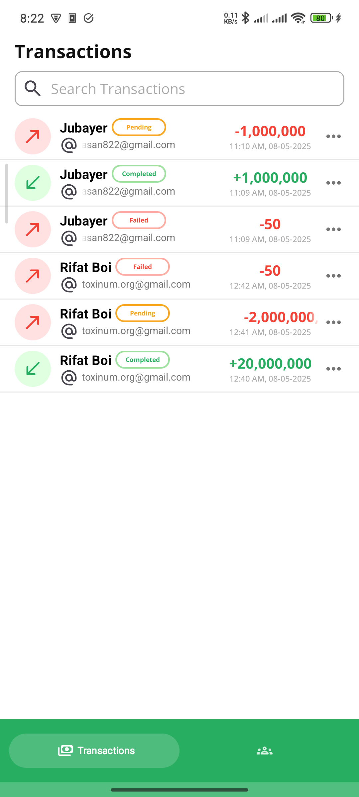
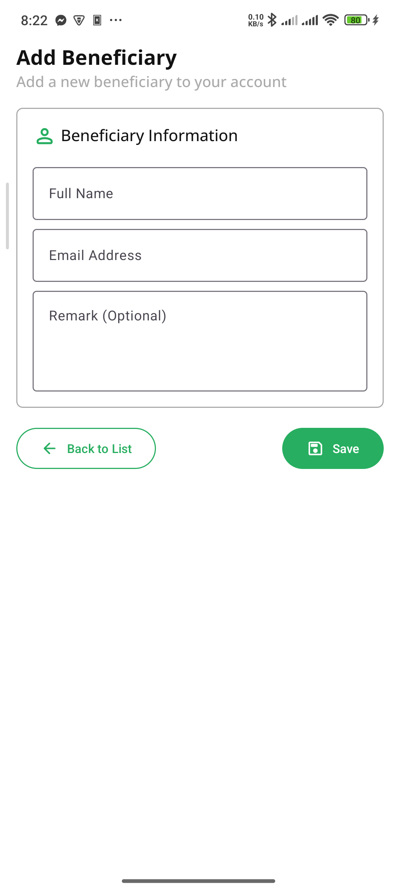
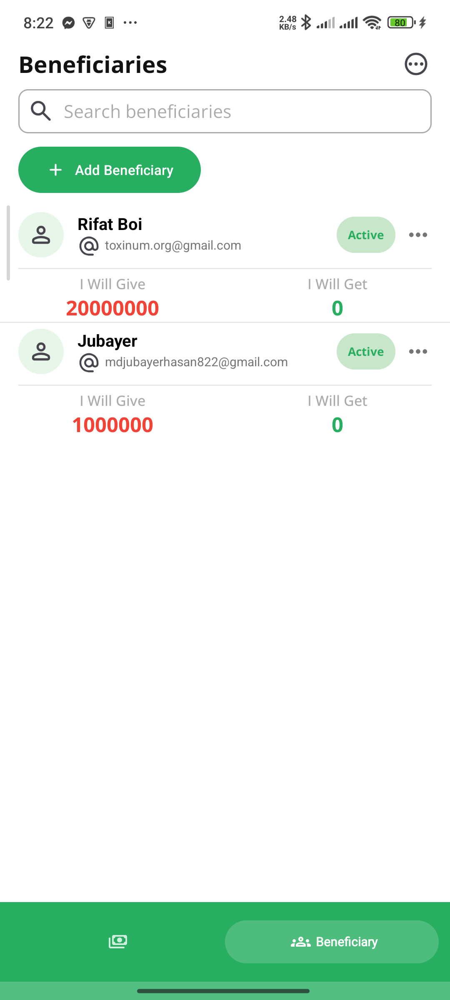
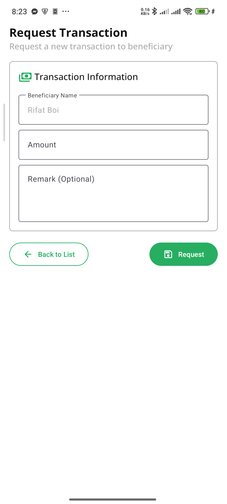

# 📘 Hisabnama

**Hisabnama** is your personal borrowing and lending tracker. Whether you're helping a friend or borrowing for yourself, this app keeps your financial records clear, organized, and accessible—so you never forget who owes what!

---

## ✨ Features

* ✅ **Add Borrow/Lend Records** – Track every transaction with amount, date, and notes.
* 🔁 **Track Settlements** – Mark debts as paid or partially paid.
* 📊 **Visual Reports** – View clear summaries of money in and out.
* 🔔 **Reminders** – Stay notified about pending dues.
* 🔒 **Secure & Private** – Your data stays with you.

---

## 📱 App Screenshots

### 🔍 Preview

  

    <strong>Home Screen</strong>
    
  

  

    <strong>Add Beneficiary</strong>
    
  

  

    <strong>Beneficiaries</strong>
    
  

  

    <strong>Request Transaction</strong>
    
  

📱 On smaller screens, the layout adjusts automatically. No need to scroll sideways!

---

## 🚀 Get Started

1. **Download the App:**

   

2. **Create an Account:** Sign up with your email address.

3. **Start Tracking:** Add your first borrowing or lending record!

---

## 📖 How to Use

* **➕ Add a Transaction:**
  Select a beneficiary, enter the amount, notes, and save the record.

* **📝 Edit or Settle Transactions:**
  Tap any record on the Home screen to view details, make changes, or mark it as settled.

* **📋 View Reports:**
  Check summaries and transaction history directly from the Home screen.

---

## 💡 Why Choose Hisabnama?

* 📌 Never forget a borrowing or lending.
* 💬 Keep things transparent with friends and family.
* ⚡ Lightweight, intuitive, and secure.

---

## 🤝 Contributing

Want to improve **Hisabnama**?
We welcome your ideas and code! Submit a [pull request](https://github.com/apurboislam/Hisabnama/pulls).

---

## 📬 Feedback

Found a bug or have a suggestion?
Let us know by opening an [issue](https://github.com/apurboislam/Hisabnama/issues).

---

## 🔽 Start Now

> Start managing your borrowings and lendings with confidence—
> **Download Hisabnama today!**